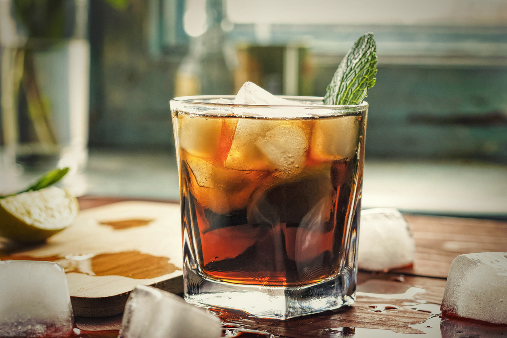

# Menu

## Pizze klasyczne

| Nr. | Nazwa    | Składniki                                                 | Cena  | Rozmiar | Wegetariańska  |
|----|----------|-----------------------------------------------------------|-------|---------|----------------|
| 1  | Vesuvio  | sos pomidorowy, ser, pieczarki                            | 22 zł | 32 cm   | ✅             |
| 2  | Serowa   | sos pomidorowy, ser żółty, ser camembert, ser mozarella   | 23 zł | 32 cm   | ✅             |
| 3  | Rukola   | sos pomidorowy, ser, rukola                               | 22 zł | 32 cm   | ✅             |
| 4  | Salami   | sos pomidorowy, ser, salami                               | 25 zł | 32 cm   | ❌             |
| 5  | Milano   | sos pomidorowy, ser, szynka                               | 24 zł | 32 cm   | ❌             |
| 6  | Hawajska | sos pomidorowy, ser, szynka, ananas                       | 24 zł | 32 cm   | ❌             |
| 7  | Rybna    | sos pomidorowy, ser, łosoś                                | 27 zł | 32 cm   | ❌             |

## Makarony

| Nr. | Nazwa              | Składniki                                               | Cena  | Wegetariańskie | Rodzaj makaronu |
|----|--------------------|----------------------------------------------------------|-------|----------------|-----------------|
| 1  | Spaghetti Bolognese| makaron, sos pomidorowy, mięso mielone, parmezan        | 26 zł | ❌              | spaghetti       |
| 2  | Carbonara           | makaron, śmietanka, jajko, boczek, parmezan             | 27 zł | ❌              | spaghetti       |
| 3  | Penne Arrabbiata    | makaron, sos pomidorowy, czosnek, papryczka chili       | 24 zł | ✅              | penne           |
| 4  | Tagliatelle Alfredo | makaron, śmietanka, masło, parmezan                     | 25 zł | ✅              | tagliatelle     |
| 5  | Lasagne             | płaty makaronu, sos boloński, beszamel, ser             | 29 zł | ❌              | lasagne         |
| 6  | Ravioli z ricottą   | ravioli, ricotta, szpinak, masło szałwiowe              | 28 zł | ✅              | ravioli         |

## Napoje

| Nr. | Napój            | Rodzaj         | Pojemność | Cena | Gazowany |
|----|------------------|----------------|-----------|------|----------|
| 1  | Cola             | napój słodzony | 0,5 l     | 6 zł | ✅       |
| 2  | Sprite           | napój słodzony | 0,5 l     | 6 zł | ✅       |
| 3  | Woda             | woda mineralna | 0,5 l     | 4 zł | ❌/✅    |
| 4  | Tonic            | napój gazowany | 0,5 l     | 6 zł | ✅       |
| 5  | Sok pomidorowy   | sok warzywny   | 0,33 l    | 5 zł | ❌       |
| 6  | Piwo             | alkohol        | 0,5 l     | 8 zł | ✅       |
